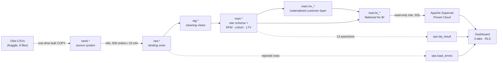

# Sales & Customer Analytics (Olist)

An end-to-end analytics build on the Olist Brazilian e-commerce dataset: a
scheduled ingestion pipeline into cloud Postgres, a star schema and the full
analytical layer (RFM, cohort retention, LTV, Pareto) modelled in **SQL**, and a
three-tab **Apache Superset** dashboard on top.

99,441 orders ingested, 0 rejected, 13/13 data-quality assertions passing.

> **Live dashboard:** `<paste your Preset link here>`
> **Data as of:** 2018-10-17 (dataset end) · **Pipeline:** n8n, every 15 min

---

## Architecture



**Stack:** PostgreSQL 18 (Neon, free tier) · n8n · Apache Superset (Preset Cloud) · SQL

---

## The two decisions that shaped this build

**All transformation is SQL, not in the BI tool.** Cleaning, conformance and
modelling happen upstream in Postgres views; the BI layer receives data that is
already finished. That kept the project portable: it was originally built
against Power BI and moved to Superset without touching a single transformation,
because none of them lived in the BI tool. The logic is reviewable in version
control instead of buried in a binary.

**The pipeline drips.** n8n moves 500 orders every 15 minutes rather than
loading 99k at once, so the whole thing behaves like a production feed: a
watermark, idempotent retries, a rejected-rows table, and eleven post-batch
assertions that stop the run when the model would otherwise go quietly wrong.

---

## Repository

```
RUNBOOK.md                    start here, ordered walkthrough
sql/
  00_schemas.sql              schema layers + extensions
  01_tables_seed_raw_ops.sql  physical tables: source, landing, telemetry
  02_ingest_functions.sql     the drip engine: safe casts, validation, rejects
  03_staging.sql              cleaning layer (this replaces Power Query)
  04_dim_date.sql             date dimension, whole years, contiguous
  05_dimensions.sql           dim_customer / product / seller / geo / payment
  06_facts.sql                fact_sales (item grain) + fact_orders (order grain)
  07_analytics.sql            vw_rfm · vw_cohort · vw_customer_ltv · vw_category_pareto
  08_post_batch.sql           materialised customer layer + post-batch refresh
  09_data_quality.sql         11 assertions + pipeline health views
  10_insight_queries.sql      the analyst's notebook, fills in docs/05
  11_rls_mapping.sql          user → region table for dynamic RLS
  12_superset_views.sql       flattened bi_* datasets (Superset has no joins)
  13_superset_role.sql        least-privilege read-only role
  99_reset.sql                deliberate wipe of the landing zone
n8n/
  olist_drip_ingest.json      importable workflow
dax/
  measures.md                 ~45 measures, grouped, with the reasoning
docs/
  01-neon-setup.md            cloud Postgres, and why Neon over Supabase/Aiven
  02-pipeline.md              n8n setup and what to point at in an interview
  03-powerbi.md               the Power BI / Fabric path (kept, see note below)
  04-dashboard.md             page-by-page report spec (tool-agnostic)
  05-insights.md              one-page insight summary, real numbers
  06-superset.md              Preset → Neon, datasets, metrics, RLS  ← current
scripts/
  00_download_data.sh  01_setup_db.sh  02_load_seed.sh  03_drip.sh
  04_superset_role.sh  set_password.sh  _common.sh
```

---

## Quickstart

Full step-by-step, including the browser parts: **[RUNBOOK.md](RUNBOOK.md)**.

```bash
cp scripts/.env.example scripts/.env    # paste your Neon connection strings
scripts/00_download_data.sh             # Olist CSVs
scripts/01_setup_db.sh                  # schemas, tables, functions, views
scripts/02_load_seed.sh                 # bulk-load the source
scripts/03_drip.sh                      # fast-forward the pipeline locally
psql "$DATABASE_URL" -f sql/10_insight_queries.sql
```

```bash
scripts/04_superset_role.sh             # least-privilege role + connection URI
```

Then import `n8n/olist_drip_ingest.json` and follow `docs/06-superset.md`.

---

## Modelling notes worth reading

**`customer_id` is not a customer.** Olist issues a fresh `customer_id` on every
order; `customer_unique_id` is the person. Every customer-level object keys on
the latter. Getting this wrong makes the repeat-purchase rate come out as
exactly 0% and silently invalidates RFM, cohort and LTV. A data-quality check
(`customer_grain_collapsed`) asserts against it on every batch.

**Two facts, two grains.** Review score and delivery time belong to an *order*.
Carrying them on the item grain and averaging weights every order by how many
items it contained. `fact_sales` (item) and `fact_orders` (order) share the same
dimensions and a reconciliation check asserts their revenue totals agree.

**Recency is measured against the data, not the clock.** The dataset ends in
2018. `mart.v_analysis_date` defines "today" as the last purchase date, so RFM
means something.

**RFM frequency is banded, not quintiled.** ~97% of these customers order
exactly once, so `NTILE(5)` on frequency splits identical customers across
buckets on tie-break order alone. The bands are explicit and commented.

**Rejected rows are kept.** Every row that fails validation goes to
`ops.load_errors` with its original payload and a reason. The reject *rate* is a
monitored metric, and both are visible in the report.

---

## On the BI tool

This was built against Power BI first and moved to Superset. The move cost one
new SQL file (`12_superset_views.sql`, which flattens the star schema because
Superset has no relationship layer) and a rewrite of the measures, and touched
no cleaning, no dimensional model, no pipeline code.

That is the argument for pushing transformation into the warehouse, made
concretely rather than as a slogan. `docs/03-powerbi.md` is kept in the repo:
the Power BI path works, and the two guides side by side show the same model
serving two very different tools.

There is no `.pbix` and no Power Query M in this repo. The transformation work
is in `sql/03_staging.sql` and `sql/05_dimensions.sql`. Worth skimming a Power
Query tutorial before interviews anyway, so the answer is "I chose SQL" rather
than "I have not used Power Query".

## Data

[Olist Brazilian E-Commerce Public Dataset](https://www.kaggle.com/datasets/olistbr/brazilian-ecommerce):
~100k orders, Sept 2016 to Oct 2018, CC BY-NC-SA 4.0. Not redistributed here;
`scripts/00_download_data.sh` fetches it.
